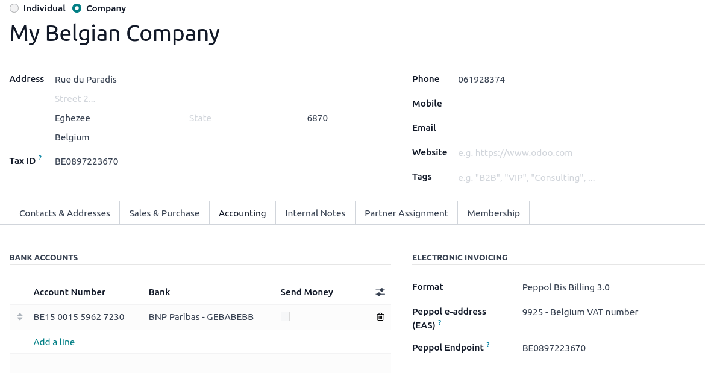
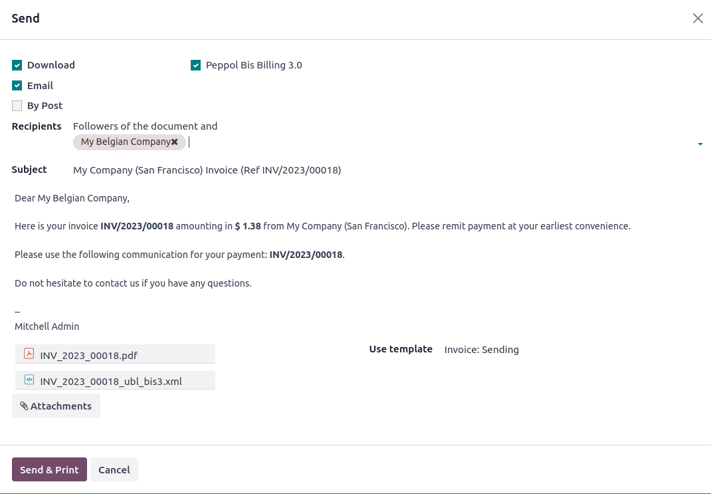

================================================================
Electronic invoicing (:abbr:`EDI (electronic data interchange)`)
================================================================

EDI, or electronic data interchange, is the inter-company communication of business documents, such
as purchase orders and invoices, in a standard format. Sending documents according to an EDI
standard ensures that the machine receiving the message can interpret the information correctly.
Various EDI file formats exist and are available depending on your company's country.

EDI feature enables automating the administration between companies and might also be required by
some governments for fiscal control or to facilitate the administration.

Electronic invoicing of your documents such as customer invoices, credit notes or vendor bills is
one of the application of EDI.

Odoo supports, among others, the following formats.

.. list-table::
   :header-rows: 1

   * - Format Name
     - Applicability
   * - Factur-X (CII)
     - For any partner
   * - Peppol BIS Billing 3.0
     - For any partner
   * - XRechnung (UBL)
     - For any partner
   * - Fattura PA (IT)
     - For Italian companies
   * - CFDI (4.0)
     - For Mexican companies
   * - Peru UBL 2.1
     - For Peruvian companies
   * - SII IVA Llevanza de libros registro (ES)
     - For Spanish companies
   * - UBL 2.1 (Columbia)
     - For Colombian companies
   * - Egyptian Tax Authority
     - For Egyptian companies
   * - E-Invoice (IN)
     - For Indian companies
   * - NLCIUS (Netherlands)
     - For Dutch companies
   * - EHF 3.0
     - For Norwegian companies
   * - SG BIS Billing 3.0
     - For Singaporean companies
   * - A-NZ BIS Billing 3.0
     - For any partner

.. seealso::
   :ref:`fiscal_localizations/packages`

.. _e-invoicing/configuration:

Configuration
=============

Customer-specific electronic invoicing formats are available by going to :menuselection:`Accounting
--> Customers --> Customers`. Once in the customer view, in the :guilabel:`Accounting` tab the specific
electronic format can be chosen.

Peppol formats
--------------

Use the fields :guilabel:`Peppol e-address (EAS)` (`list <https://docs.peppol.eu/poacc/billing/3.0/codelist/eas/>`_)
and :guilabel:`Peppol Endpoint` to identify the recipient in the Peppol Network.

.. example::
   .. list-table::
      :header-rows: 1

      * - Partner's country
        - Peppol e-address (EAS)
        - Peppol Endpoint
      * - Luxembourg
        - 9938 - Luxemburg VAT number
        - a valid Luxemburgish VAT number
      * - Netherlands
        - 0190 - Dutch Originator's Identification Number
        - a valid OIN number
      * - Belgium
        - 9925 - Belgium VAT number
        - a valid Belgian VAT number

.. note::
   If **Factur-X (CII)** is selected, the invoice PDF will be PDF/A3 compliant.

Other formats
-------------

For the other formats, go to :menuselection:`Accounting --> Configuration --> Journals --> Customer
Invoices --> Advanced Settings --> Electronic Invoicing` and enable the formats you need for this
journal.

Generating an E-invoice
-----------------------

Use the :guilabel:`Send & Print` button on invoices to select the documents to be generated.

